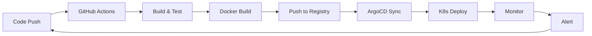

# DevOps Engineer

Cloud, containers, CI/CD, and infrastructure-as-code — the ops side of dev. Features a shark capsule header, categorized tech badges, WakaTime stats, trophies, and a Mermaid.js CI/CD pipeline diagram.

---

## 👀 Live Preview

<div align="center">
  
</div>

<h1 align="center">Linus Torvalds</h1>
<h3 align="center">Automating everything 🤖</h3>

<p align="center">
  <a href="https://linkedin.com/in/torvalds"></a>
  <a href="https://hub.docker.com/u/torvalds"></a>
  <a href="https://medium.com/@torvalds"></a>
  <a href="https://torvalds.com"></a>
</p>

---

### ☁️ Cloud & Infrastructure

<p align="center">
  
  
  
  
  
  
</p>

### 🐳 Containers & Orchestration

<p align="center">
  
  
  
  
  
</p>

### 🔄 CI/CD & Monitoring

<p align="center">
  
  
  
  
  
  
</p>

---

### 📈 Weekly Stats

<!--START_SECTION:waka-->
```text
YAML       ████████████████░░░░░░   65%
HCL        ████░░░░░░░░░░░░░░░░░░   15%
Dockerfile ███░░░░░░░░░░░░░░░░░░░   10%
Shell      ██░░░░░░░░░░░░░░░░░░░░   5%
Go         █░░░░░░░░░░░░░░░░░░░░░   5%
```
<!--END_SECTION:waka-->

---

### 📊 GitHub Stats

<p align="center">
  
  
</p>

<p align="center">
  
</p>

---

### 🏗️ Infrastructure



---

<div align="center">
  
  <p>⚡ "It works on my machine... and in production too"</p>
</div>

> ⚡ **This is what your profile will look like** — just replace with your info below.

---

## 📋 Ready-to-Use Code

```markdown
<div align="center">
  
</div>

<h1 align="center"><your-name></h1>
<h3 align="center">Automating everything 🤖</h3>

<p align="center">
  <a href="https://linkedin.com/in/yourusername"></a>
  <a href="https://hub.docker.com/u/yourusername"></a>
  <a href="https://medium.com/@yourusername"></a>
  <a href="https://yourwebsite.com"></a>
</p>

---

### ☁️ Cloud & Infrastructure

<p align="center">
  
  
  
  
  
  
</p>

### 🐳 Containers & Orchestration

<p align="center">
  
  
  
  
  
</p>

### 🔄 CI/CD & Monitoring

<p align="center">
  
  
  
  
  
  
</p>

---

### 📈 Weekly Stats

<!--START_SECTION:waka-->
```text
YAML       ████████████████░░░░░░   65%
HCL        ████░░░░░░░░░░░░░░░░░░   15%
Dockerfile ███░░░░░░░░░░░░░░░░░░░   10%
Shell      ██░░░░░░░░░░░░░░░░░░░░   5%
Go         █░░░░░░░░░░░░░░░░░░░░░   5%
```
<!--END_SECTION:waka-->

---

### 📊 GitHub Stats

<p align="center">
  
  
</p>

<p align="center">
  
</p>

---

### 🏗️ Infrastructure


---

<div align="center">
  
  <p>⚡ "It works on my machine... and in production too"</p>
</div>
```

---

## 🔧 Complete Customization Guide

### Step 1: Basic Information
| What to Replace | Where It Appears | Replace With | Example |
|----------------|-----------------|--------------|---------|
| `<your-name>` | Main heading | Your full name | Marcus Johnson |
| `yourusername` | ALL URLs, stats, trophies, Docker Hub, visitor counter | Your GitHub username | marcusjohnson |
| `yourwebsite.com` | Blog badge link | Your blog URL | https://marcusjohnson.dev |

### Step 2: Social Links
Replace these badge URLs:
- `https://linkedin.com/in/yourusername` → `https://linkedin.com/in/YOUR_LINKEDIN`
- `https://hub.docker.com/u/yourusername` → `https://hub.docker.com/u/YOUR_DOCKER_HUB`
- `https://medium.com/@yourusername` → `https://medium.com/@YOUR_HANDLE`
- `https://yourwebsite.com` → Your blog or portfolio

### Step 3: Cloud & Infrastructure Badges
Update the badges to match your actual cloud stack:
- Add more cloud providers: `DigitalOcean`, `Cloudflare`, `Linode`, `Vercel`
- Replace Terraform/Ansible/Pulumi with what you use: `Crossplane`, `CDK`, `Chef`, `SaltStack`
- Change badge colors: `color=FF9900` for AWS yellow, `color=4285F4` for GCP blue

### Step 4: Containers & Orchestration
Customize to your container tooling:
- Common additions: `Podman`, `containerd`, `CRI-O`, `Rancher`, `OpenShift`, `Nomad`
- Service mesh: `Linkerd`, `Consul`, `Kuma`

### Step 5: CI/CD & Monitoring
Replace with your actual tooling:
- CI/CD: `CircleCI`, `Travis CI`, `TeamCity`, `Drone`, `Buildkite`
- Monitoring: `New Relic`, `Dynatrace`, `Sentry`, `ELK Stack`, `Loki`

### Step 6: WakaTime Weekly Stats
To enable live WakaTime stats:
1. Sign up at `https://wakatime.com` and connect your IDE
2. Go to your WakaTime profile → `https://wakatime.com/settings/api-key`
3. Set up the GitHub Action from `https://github.com/marketplace/actions/waka-readme`
4. The `<!--START_SECTION:waka-->` markers will auto-fill with real data
5. Without the action, the static stats shown here will remain as placeholders

### Step 7: Stats, Streak & Trophies
Replace `yourusername` in all three:
- `https://github-readme-stats.vercel.app/api?username=yourusername&...`
- `https://github-readme-streak-stats.herokuapp.com/?user=yourusername&...`
- `https://github-profile-trophy.vercel.app/?username=yourusername&...`

### Step 8: Mermaid Pipeline Diagram
The Mermaid.js diagram renders automatically on GitHub. Customize:
- Change node labels: `[Code Push]`, `[GitHub Actions]`, etc.
- Change the flow: Add stages like `Security Scan`, `Staging Deploy`, `Smoke Test`
- See Mermaid.js syntax at `https://mermaid.js.org/syntax/flowchart.html`

---

## 💡 Pro Tips

1. **Noctis Minimus theme**: The `theme=noctis_minimus` is a dark, muted theme that fits the ops aesthetic. Try `theme=nightowl` or `theme=city_lights` for alternatives.
2. **Docker Hub badge**: If you don't actively use Docker Hub, replace it with a `Package Registry` or `GitHub Container Registry` badge.
3. **WakaTime integration**: The WakaTime stats auto-update daily if you set up the GitHub Action. It's a strong signal to employers that you code consistently.
4. **Mermaid diagram**: GitHub natively supports Mermaid. The pipeline diagram is a visual representation of your CI/CD workflow — make it match your actual pipeline for maximum impact.
5. **Shark capsule header**: The `type=shark` gives a unique zigzag pattern. Try `type=wave`, `type=soft`, or `type=cylinder` for different header shapes.

---

## 🚀 One-Click Deploy

1. Copy everything inside the **"Ready-to-Use Code"** block above
2. Go to your profile repo: `github.com/YOUR_USERNAME/YOUR_USERNAME`
3. Open `README.md` and paste over everything
4. Press **Ctrl+H** (or **Cmd+H** on Mac) → find `yourusername` → **Replace All** with actual username
5. Replace `<your-name>`, `yourwebsite.com`
6. Customize cloud, container, and CI/CD badges to match your stack
7. Update the Mermaid pipeline diagram if needed
8. Commit — your new profile is LIVE! 🎉

---


