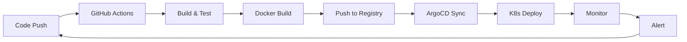

# DevOps Engineer

Cloud, containers, CI/CD, and infrastructure-as-code — the ops side of dev.


## 📋 Copy this

```markdown
<div align="center">
  
</div>

<h1 align="center"><your-name></h1>
<h3 align="center">Automating everything 🤖</h3>

<p align="center">
  <a href="https://linkedin.com/in/yourusername"></a>
  <a href="https://hub.docker.com/u/yourusername"></a>
  <a href="https://medium.com/@yourusername"></a>
  <a href="https://yourwebsite.com"></a>
</p>

---

### ☁️ Cloud & Infrastructure

<p align="center">
  
  
  
  
  
  
</p>

### 🐳 Containers & Orchestration

<p align="center">
  
  
  
  
  
</p>

### 🔄 CI/CD & Monitoring

<p align="center">
  
  
  
  
  
  
</p>

---

### 📈 Weekly Stats

<!--START_SECTION:waka-->
```text
YAML       ████████████████░░░░░░   65%
HCL        ████░░░░░░░░░░░░░░░░░░   15%
Dockerfile ███░░░░░░░░░░░░░░░░░░░   10%
Shell      ██░░░░░░░░░░░░░░░░░░░░   5%
Go         █░░░░░░░░░░░░░░░░░░░░░   5%
```
<!--END_SECTION:waka-->

---

### 📊 GitHub Stats

<p align="center">
  
  
</p>

<p align="center">
  
</p>

---

### 🏗️ Infrastructure



---

<div align="center">
  
  <p>⚡ "It works on my machine... and in production too"</p>
</div>
```

## 🔧 Customization

| Variable | Replace with |
|----------|-------------|
| `your-name` | Your name |
| `yourusername` | Your GitHub username |
| `yourwebsite.com` | Your blog/website |

## ✨ Features

- Cloud provider badges (AWS, GCP, Azure)
- Container/Orchestration badges
- CI/CD pipeline badges
- WakaTime coding stats
- Mermaid.js pipeline diagram
- DevOps-specific tech stack
